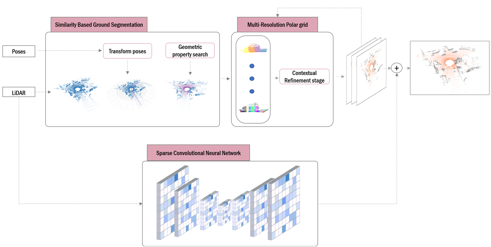

# Ground Segmentation for LiDAR Point Clouds in Structured and Unstructured Environments using a Hybrid Neural-Geometric approach
This paper introduces a hybrid framework that synergizes multi-resolution polar discretization with sparse convolutional neural networks (SCNNs) to address these challenges. The method hierarchically partitions point clouds into adaptive sectors, leveraging PCA-derived geometric features and dynamic variance thresholds for robust terrain modeling, while a SCNN resolves ambiguities in data-sparse regions. 


The method begins by discretizing the spatial domain into coarse-resolution polar sectors by means of CZM. This initial discretization establishes the core representation of the environment, allowing efficient extrapolation of geometric knowledge from historically traversed regions across the entire discretized space. 

Following this initialization, sector classification is iteratively refined using geometric criteria designed to minimize the dependence on point density. Thus, at each level of resolution, for each sector and its adjacencies, the plane coefficients are estimated after a selection of seeds suitable for Principal Component Analysis (PCA) calculation, mitigating the density-dependent limitations in traditional methods like RANSAC. In order to address the limitations of the geometric approach,TE-NeXt, a sparse convolutional neural network is introduced. This network is based on an encoder-decoder architecture adapted to the three-dimensional domain.




# Installation
## Requirements Python
- Ubuntu >= 14.04
- CUDA >= 10.1.243 and the same CUDA version used for pytorch (e.g. if you use conda cudatoolkit=11.1, use CUDA=11.1 for MinkowskiEngine compilation)
- pytorch >= 1.7 You must match the CUDA version pytorch uses and CUDA  version used for Minkowski Engine installation.
- python >= 3.6
- ninja (for installation)
- GCC >= 7.4.0
## Requirements C++
- PCL 1.3 
- Eigen3 3.3 
- Gazebo
## TE-NeXt installation
Please refer to https://github.com/ARVCUMH/te-next.git for a properly installation and training process.
## Build & Run C++ code
Once the inferences by the sparse convolutional neural Networks have been done, the C++ code makes the geometric study. 
````
mkdir build
cd build
cmake ..
make
./paper
````
